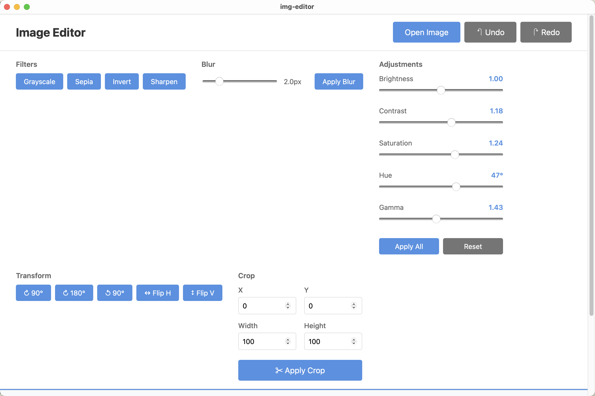

# Image Editor

A modern, high-performance desktop image editor built with Rust and Tauri. Features non-destructive editing with full undo/redo support, real-time previews, and a clean, intuitive interface.

## ✨ Features

### Image Operations
- **Filters**: Grayscale, Sepia, Invert, Blur (with radius control), Sharpen
- **Adjustments**: Brightness, Contrast, Saturation, Hue rotation, Gamma correction
- **Transforms**: Rotate (90°, 180°, 270°), Flip Horizontal/Vertical
- **Crop**: Rectangular selection with boundary validation

### Workflow
- **Non-destructive Editing**: Original image preserved, all operations stored in history
- **Undo/Redo**: Full operation history with rebuild-from-original architecture
- **Real-time Preview**: All operations shown instantly with optimized rendering
- **Export**: Save edited images in JPEG, PNG, or WebP formats with quality control

## 🛠️ Tech Stack

### Backend
- **Rust 2024** - High-performance image processing
- **Tauri 2.9** - Cross-platform desktop framework
- **image 0.25** - Core image manipulation library
- **imageproc 0.25** - Advanced image processing algorithms
- **rayon 1.10** - Parallel pixel processing
- **tokio 1.x** - Async runtime for I/O operations
- **arc-swap 1.8** - Lock-free concurrent state management

### Frontend
- **Svelte 5** - Reactive UI framework with mount() API
- **Vite 5.4** - Fast development and build tooling
- **TypeScript 5.3** - Type-safe frontend development

### Architecture
- **Non-blocking I/O**: All heavy operations run in background threads
- **Lock-free reads**: ArcSwap for concurrent image state access
- **Type safety**: Full Rust-to-TypeScript type generation
- **Error handling**: Comprehensive error types with user-friendly messages

## 📋 Prerequisites

- **Node.js** 18+ and npm
- **Rust** 1.92+ (install via [rustup](https://rustup.rs/))
- **System dependencies** (platform-specific):
  - **macOS**: Xcode Command Line Tools
  - **Linux**: `libwebkit2gtk-4.1-dev`, `build-essential`, `curl`, `wget`, `file`, `libssl-dev`, `libayatana-appindicator3-dev`, `librsvg2-dev`
  - **Windows**: Microsoft C++ Build Tools

## 🚀 Getting Started

### Installation

1. **Clone the repository**
   ```bash
   git clone https://github.com/yourusername/img-editor.git
   cd img-editor
   ```

2. **Install dependencies**
   ```bash
   npm install
   ```

### Development

**Start the development server:**
```bash
make dev
# or
npm run tauri dev
```

The application will open automatically with hot-reload enabled for both Rust and Svelte code.

### Building

**Create a production build:**
```bash
make build
# or
npm run tauri build
```

Built applications will be in `src-tauri/target/release/bundle/`.

### Testing

**Run unit tests:**
```bash
cargo test --lib
```

**Run specific test suite:**
```bash
cargo test --lib export_engine  # Export functionality tests
cargo test --lib image_processor  # Image processing tests
```

## 📖 Usage

1. **Open an Image**
   - Click "Open Image" button
   - Select PNG, JPEG, GIF, BMP, WebP, or TIFF file
   - Preview loads automatically (max 800x600)

2. **Apply Operations**
   - Use filter buttons for quick effects
   - Adjust sliders for fine-tuning (brightness, contrast, etc.)
   - Transform images with rotation and flip buttons
   - Crop to specific dimensions with X, Y, Width, Height inputs

3. **Undo/Redo**
   - Click ↶ Undo to revert last operation
   - Click ↷ Redo to restore undone operation
   - All operations rebuild from original image

4. **Export**
   - Select format: JPEG, PNG, or WebP
   - Adjust quality (1-100) for JPEG
   - Click "💾 Save Image"
   - Choose destination and save

## 🏗️ Project Structure

```
img-editor/
├── src/                      # Rust backend
│   ├── commands/            # Tauri command handlers
│   │   ├── export_commands.rs
│   │   └── image_commands.rs
│   ├── core/                # Core image processing
│   │   ├── export_engine.rs
│   │   ├── history_manager.rs
│   │   ├── image_processor.rs
│   │   └── operations/      # Image operations
│   │       ├── adjustments.rs
│   │       ├── crop.rs
│   │       ├── filters.rs
│   │       └── transform.rs
│   ├── state/               # Application state
│   │   └── image_state.rs
│   ├── types/               # Type definitions
│   │   ├── commands.rs
│   │   ├── errors.rs
│   │   └── operations.rs
│   └── utils/               # Utility functions
│       └── base64.rs
├── frontend/                # Svelte frontend
│   ├── src/
│   │   ├── App.svelte      # Main UI component
│   │   └── services/
│   │       └── tauri.ts    # Type-safe Tauri API wrapper
│   └── public/
├── specs/                   # Design specifications
└── tests/                   # Integration tests
```

## 🧪 Testing

The project includes comprehensive unit tests:

- **19 unit tests** covering:
  - Export functionality (JPEG, PNG, WebP)
  - Image filters (grayscale, sepia, invert, blur, sharpen)
  - Adjustments (brightness, contrast, saturation, hue, gamma)
  - Transforms (rotate, flip)
  - Crop operations with validation
  - HSL color space conversions

**Test coverage:**
- Export engine: Format validation, quality bounds, file creation
- Image processor: Filter application, validation
- Operations: Individual operation correctness
- Crop: Boundary validation, aspect ratio maintenance

## 🎯 Performance

- **Parallel Processing**: Rayon-based parallel pixel operations
- **Lock-free State**: ArcSwap for concurrent reads without locks
- **Async I/O**: Non-blocking file operations with Tokio
- **Optimized Builds**: LTO and size optimization in release mode
- **Memory Efficient**: Stream-based image encoding/decoding

## 📝 License

This project is licensed under the MIT License.

## 🤝 Contributing

Contributions are welcome! Please feel free to submit a Pull Request.

## Screen Shot


