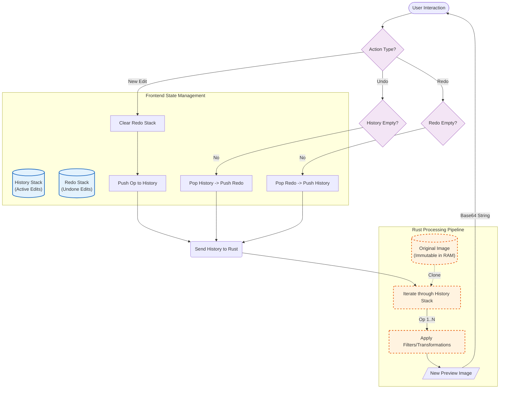

### Project Name: `img-editor`

---

### 1. High-Level Architecture

To ensure high performance (60 FPS UI) and high-quality exports, we will use a **Non-Destructive Editing Pipeline**.

* **Frontend (The "View"):** Handles user interaction, rendering a **low-res preview** of the image, and managing the "Edit History" (Undo/Redo stack). It uses WebGL or Canvas API for real-time visual feedback (e.g., moving a brightness slider instantly updates the screen without waiting for Rust).
* **Backend (The "Processor"):** Rust holds the **original full-resolution image** in memory. It only processes pixels when you:
1. Load an image.
2. Apply a "destructive" change (like Crop/Resize).
3. Export (Save) the final result.


* **Communication:** The Frontend sends an "Operation Struct" (e.g., `{ op: "brightness", value: 1.2 }`) to the Backend.

---

### 2. Tech Stack Selection

#### **Core Framework**

* **Tauri v2:** The application shell.
* *Why v2?* Improved mobile support (future-proofing), cleaner permission system, and better IPC (Inter-Process Communication).


#### **Backend (Rust)**

* **`image` crate:** The standard library for decoding/encoding (PNG, JPEG) and pixel manipulation.
* **`imageproc`:** For drawing text, geometric shapes, and advanced operations.
* **`rayon`:** For parallel processing (speeding up filters on large images).
* **`base64`:** To send image previews to the frontend.

#### **Frontend (UI)**

* **React or Svelte:** (Svelte is recommended for better performance with direct DOM manipulation).
* **Fabric.js / Konva.js:** *Crucial for Phase 2.* These are HTML5 Canvas libraries. They make handling "Text Overlay" and "Drawing" trivial because they treat them as objects (vectors) rather than raw pixels.
* **TailwindCSS:** For the UI controls (sliders, buttons).

---

### 3. Data Structures & State Management

To support **Undo/Redo**, we cannot store 50 copies of a 4K image in memory. instead, we use a **Command Pattern**.

**The Edit Stack (Frontend State):**

```typescript
interface EditOperation {
  id: string;
  type: 'filter' | 'adjustment' | 'crop' | 'rotate';
  params: {
    brightness?: number; // 0.0 to 2.0
    filterName?: 'grayscale' | 'sepia';
    cropRect?: { x: number, y: number, w: number, h: number };
    rotation?: 90 | 180 | 270;
  };
}

// The State
let history: EditOperation[] = [];
let currentStep: number = -1;

```

---

### 4. Implementation Details (Essential Features)

#### **A. File Load & Save/Export**

* **Load:**
1. User clicks "Open". Tauri File Dialog opens.
2. Rust reads the file into a `DynamicImage` buffer.
3. **Optimization:** Rust resizes a copy of the image to fit the user's screen (e.g., max 1920px width) and converts it to Base64.
4. Rust sends the **Preview Base64** to the Frontend. (We don't send the full 4K raw bytes to the UI to avoid lag).


* **Save:**
1. Frontend sends the full `history` list to Rust.
2. Rust takes the *original* high-res image and re-applies all operations in order.
3. Rust writes the file to disk using the `image` crate.


#### **B. Crop & Rotate**

* **UI:** Use a library like `react-image-crop` overlaying your canvas.
* **Logic:**
* **Rotate:** Simple 90-degree increments.
* **Crop:** Frontend calculates the normalize coordinates (0.0 to 1.0) relative to the image size.
* *Note:* Crop is usually a "destructive" action in memory because it changes the canvas size. When the user confirms a crop, send the command to Rust, have Rust process it, and return a new Preview Base64 string.


#### **C. Basic Adjustments (Brightness, Contrast)**

* **The "Hybrid" Trick:**
* Do **not** use Rust for the live slider dragging. It is too slow.
* Use CSS Filters on the canvas: `filter: brightness(110%) contrast(1.2)`.
* When the user lets go of the slider, add that value to the `EditOperation` state.
* When saving, Rust maps these values to `image::imageops::brighten` etc.


#### **D. Filters (Presets)**

* **Rust Implementation:**
* **Grayscale:** `image::imageops::grayscale(&img)`
* **Invert:** `image::imageops::invert(&mut img)`
* **Custom (Vivid/Warm):** These are usually "Lookup Tables" (LUTs) or color matrix manipulations.
* *Example (Warmth):* Iterate over pixels and boost the Red channel by 10%.


---

### 5. Implementation Details (Phase 2)

#### **A. Text Overlay & Drawing**

* This is where **Fabric.js** shines.
* Instead of modifying pixels immediately, you add a "Text Object" on top of the canvas.
* **Saving:**
* *Option 1 (Easy):* Export the Canvas content from JS as a Base64 blob and save that. (Fastest, but limits resolution to the screen size).
* *Option 2 (Pro):* Send the text properties (font, size, x, y, color) to Rust. Use the `imageproc` crate to draw text onto the high-res bitmap. *Warning: Font rendering parity between Browser and Rust is hard.*
* **Recommendation:** For Phase 2, stick to Option 1 (Canvas Export) or rendering the text into a transparent PNG layer in Frontend and sending that layer to Rust to "paste" over the original image.


---

### 6. Rust Backend API (Tauri Commands)

This is the interface you will code in `main.rs`.

```rust
// main.rs structure

struct AppState {
    // Mutex to safely share state across threads
    original_image: Mutex<Option<DynamicImage>>,
    current_image: Mutex<Option<DynamicImage>>, // The one currently being edited
}

#[tauri::command]
fn open_image(path: String, state: State<AppState>) -> Result<String, String> {
    // 1. Load image from path
    // 2. Store in original_image and current_image
    // 3. Resize to "preview size"
    // 4. Return Base64 string for UI
}

#[tauri::command]
fn apply_transform(
    operation: String, // JSON string describing operation
    state: State<AppState>
) -> Result<String, String> {
    // 1. Lock current_image
    // 2. Parse operation (e.g., Rotate90)
    // 3. Apply using 'image' crate
    // 4. Return new Preview Base64
}

#[tauri::command]
fn save_image(
    path: String, 
    adjustments: AdjustmentStruct, // Brightness/Contrast values
    state: State<AppState>
) -> Result<(), String> {
    // 1. Take original_image
    // 2. Apply all crops/rotations
    // 3. Apply brightness/contrast
    // 4. Save to disk
}

```

---

### 7. Step-by-Step Development Plan

#### **Phase 1: The Core (Est. 1-2 Weeks)**

1. **Scaffold:** `npm create tauri-app@latest` (Select React/TypeScript).
2. **Image Loader:** Implement `open_image` in Rust and display it in an HTML `` or `<canvas>`.
3. **Filter Engine:** Create the UI sliders. Bind them to CSS filters for preview.
4. **Save Engine:** Implement the `save_image` command in Rust that takes the slider values and applies them to the actual file.
5. **Crop:** Integrate `react-image-crop`. Send crop coordinates to Rust.

#### **Phase 2: The "Nice-to-Haves"**

1. **Switch to Fabric.js:** Replace the standard `` tag with a Fabric Canvas. This immediately enables Text and Drawing features.
2. **Layer Merging:** Implement the logic to flatten the Fabric.js layers (text/doodles) into a single image to send to Rust for saving.

### 8. Suggested Diagram for Undo/Redo Logic

