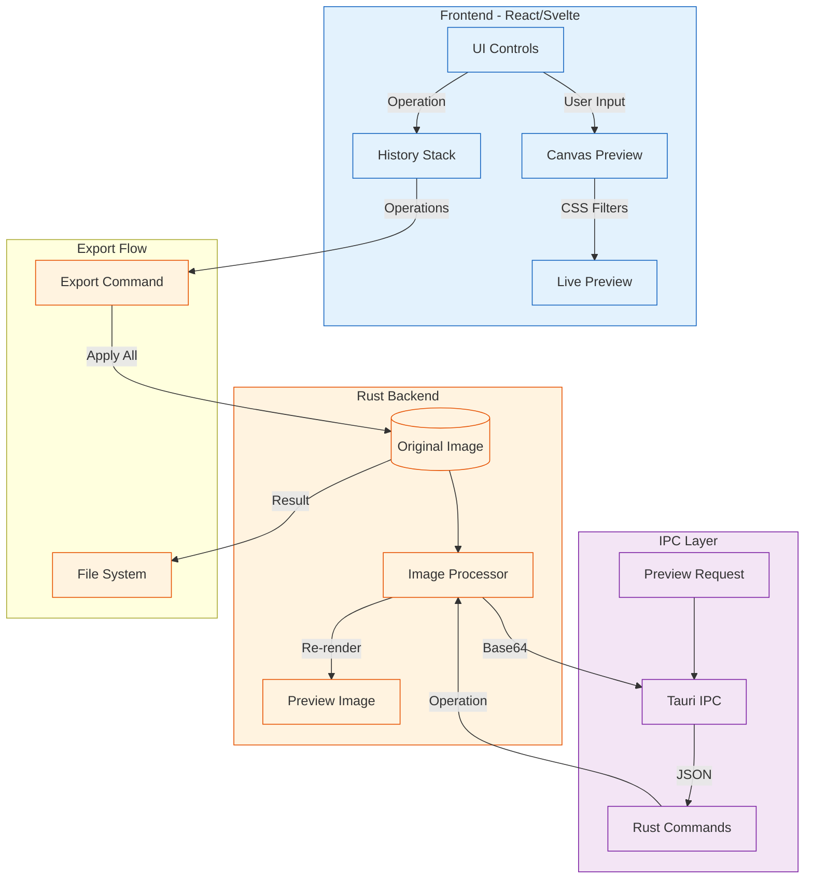
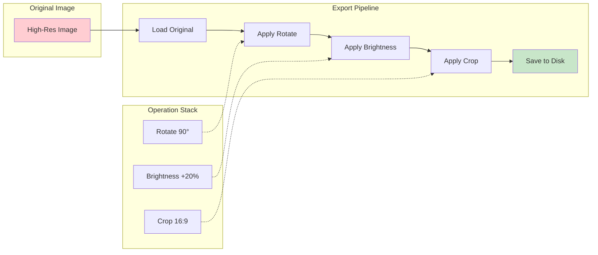
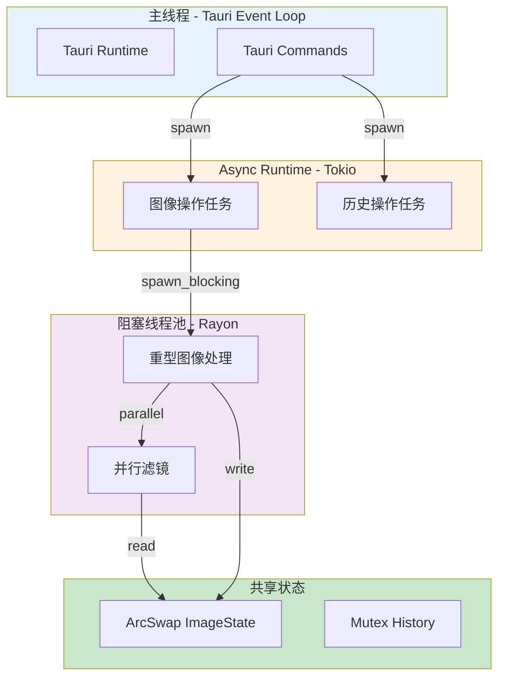
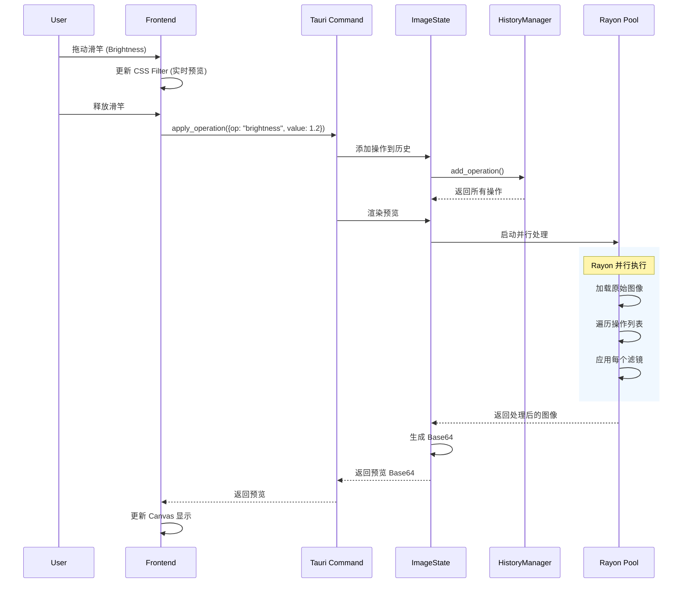
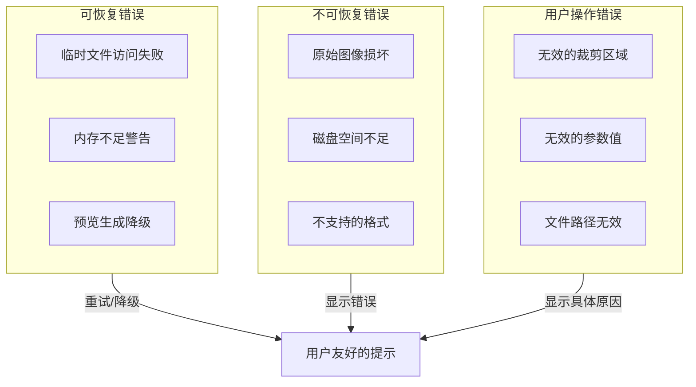
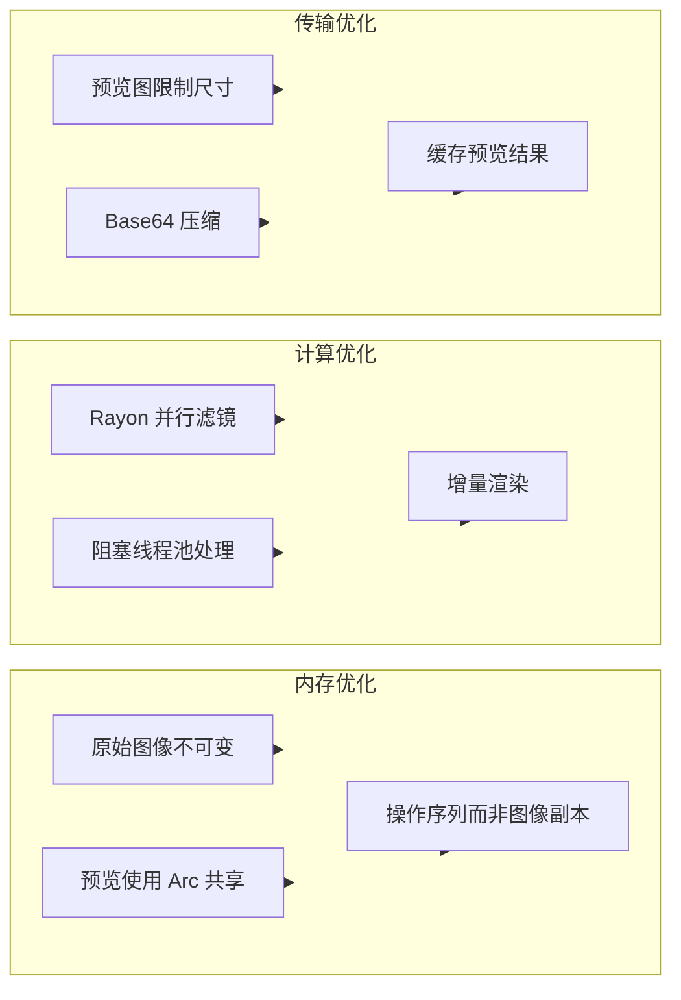

# img-editor 详细设计文档

> 版本: 1.0.0
> 日期: 2025-12-30
> 状态: 初稿

---

## 目录

1. [概述](#1-概述)
2. [技术栈与依赖](#2-技术栈与依赖)
3. [系统架构](#3-系统架构)
4. [模块划分与接口设计](#4-模块划分与接口设计)
5. [数据结构与并发模型](#5-数据结构与并发模型)
6. [错误处理策略](#6-错误处理策略)
7. [详细设计](#7-详细设计)
8. [性能优化](#8-性能优化)
9. [安全性考虑](#9-安全性考虑)

---

## 1. 概述

### 1.1 项目背景

img-editor 是一个基于 Tauri v2 的高性能图像编辑器，采用非破坏性编辑架构，实现 60 FPS 的流畅 UI 体验和高品质的图像导出。

### 1.2 设计目标

- **高性能**: UI 保持 60 FPS 响应，图像处理利用多核并行
- **非破坏性**: 保留原始图像，所有编辑操作可撤销/重做
- **跨平台**: 支持 macOS、Windows、Linux、Android、iOS
- **安全性**: 依赖经过审计的 crate，使用最新的 Rust 2024 特性

### 1.3 核心设计原则

```
┌─────────────────────────────────────────────────────────────┐
│                    核心设计原则                              │
├─────────────────────────────────────────────────────────────┤
│  1. 前端负责预览: 使用 CSS Filter 实现实时滑竿预览            │
│  2. 后端负责处理: 仅在保存/导出时进行实际像素操作              │
│  3. 内存优化: 保留原始高清图像，副本用于预览                   │
│  4. 命令模式: 编辑历史存储为操作序列而非图像副本              │
└─────────────────────────────────────────────────────────────┘
```

---

## 2. 技术栈与依赖

### 2.1 核心依赖选择

#### 2.1.1 框架与运行时

| 依赖 | 版本 | 用途 | 选择理由 |
|------|------|------|----------|
| `tauri` | 2.0+ | 应用框架 | 跨平台支持、IPC 通信、权限管理 |
| `tauri-build` | 2.0+ | 构建配置 | 必要的构建脚本支持 |

#### 2.1.2 图像处理

| 依赖 | 版本 | 用途 | 选择理由 |
|------|------|------|----------|
| `image` | 0.25.x | 图像编解码 | 支持 20+ 格式、100% 文档覆盖、并行支持 |
| `imageproc` | 0.25.x | 高级图像处理 | 滤镜、几何变换、绘图、边缘检测 |

#### 2.1.3 并发与性能

| 依赖 | 版本 | 用途 | 选择理由 |
|------|------|------|----------|
| `rayon` | 1.10+ | 数据并行 | 成熟的并行迭代器、零成本抽象 |
| `arcswap` | 1.x | 不可变数据共享 | 适合配置/状态共享，避免锁竞争 |

#### 2.1.4 数据序列化

| 依赖 | 版本 | 用途 | 选择理由 |
|------|------|------|----------|
| `serde` | 1.0.x | 序列化框架 | 事实标准、派生宏支持 |
| `serde_json` | 1.0.x | JSON 处理 | 快速、可靠 |
| `specta` | 2.x | Tauri 类型共享 | 自动生成 TypeScript 类型定义 |

#### 2.1.5 实用工具

| 依赖 | 版本 | 用途 | 选择理由 |
|------|------|------|----------|
| `base64` | 0.22.x | Base64 编解码 | 多种引擎、零拷贝支持 |
| `thiserror` | 2.0.x | 错误定义 | 优雅的错误类型派生 |
| `anyhow` | 1.0.x | 错误传播 | 灵活的错误处理 |

### 2.2 Cargo.toml 配置

```toml
[package]
name = "img-editor"
version = "0.1.0"
edition = "2024"

[dependencies]
# Core
tauri = { version = "2.0.0", features = ["core", "window-all", "shell-open"] }
tauri-build = "2.0.0"

# Image Processing
image = { version = "0.25", features = ["png", "jpeg", "gif", "bmp", "ico", "webp", "tiff", "avif-dec", "rayon"] }
imageproc = "0.25"

# Concurrency
rayon = "1.10"
arcswap = "1"

# Serialization
serde = { version = "1", features = ["derive"] }
serde_json = "1"
specta = { version = "2", features = ["typescript"] }

# Utils
base64 = "0.22"
thiserror = "2"
anyhow = "1"

[features]
default = ["custom-protocol"]
custom-protocol = ["tauri/custom-protocol"]

[profile.release]
panic = "abort"
codegen-units = 1
lto = true
opt-level = "z"
```

### 2.3 前端依赖

```json
{
  "dependencies": {
    "svelte": "^5.0.0",
    "@tauri-apps/api": "^2.0.0",
    "fabric": "^5.0.0"
  }
}
```

---

## 3. 系统架构

### 3.1 整体架构图


### 3.2 数据流图



### 3.3 非破坏性编辑流程



---

## 4. 模块划分与接口设计

### 4.1 模块结构

```
src/
├── main.rs                    # 应用入口
├── lib.rs                     # 库入口
├── commands/                  # Tauri 命令层
│   ├── mod.rs
│   ├── image_commands.rs     # 图像操作命令
│   ├── export_commands.rs    # 导出命令
│   └── state_commands.rs     # 状态命令
├── core/                      # 核心业务逻辑
│   ├── mod.rs
│   ├── image_processor.rs    # 图像处理引擎
│   ├── history_manager.rs    # 历史记录管理
│   ├── export_engine.rs      # 导出引擎
│   └── operations/           # 操作实现
│       ├── mod.rs
│       ├── filters.rs        # 滤镜操作
│       ├── adjustments.rs    # 调整操作
│       ├── transform.rs      # 变换操作
│       └── crop.rs           # 裁剪操作
├── state/                     # 状态管理
│   ├── mod.rs
│   ├── app_state.rs          # 应用状态
│   └── image_state.rs        # 图像状态
├── types/                     # 类型定义
│   ├── mod.rs
│   ├── operations.rs         # 操作类型
│   ├── errors.rs             # 错误类型
│   └── commands.rs           # 命令类型
└── utils/                     # 工具函数
    ├── mod.rs
    ├── base64.rs             # Base64 编码
    └── preview.rs            # 预览生成
```

### 4.2 核心类型定义

#### 4.2.1 操作类型

```rust
// types/operations.rs

use serde::{Deserialize, Serialize};
use std::fmt;

/// 操作类型枚举
#[derive(Debug, Clone, PartialEq, Serialize, Deserialize)]
pub enum OperationType {
    #[serde(rename = "filter")]
    Filter,
    #[serde(rename = "adjustment")]
    Adjustment,
    #[serde(rename = "transform")]
    Transform,
    #[serde(rename = "crop")]
    Crop,
}

/// 滤镜类型
#[derive(Debug, Clone, PartialEq, Serialize, Deserialize)]
#[serde(rename_all = "snake_case")]
pub enum FilterType {
    Grayscale,
    Sepia,
    Invert,
    Blur,
    Sharpen,
}

/// 调整参数
#[derive(Debug, Clone, PartialEq, Serialize, Deserialize)]
pub struct AdjustmentParams {
    #[serde(default, skip_serializing_if = "Option::is_none")]
    pub brightness: Option<f32>,
    #[serde(default, skip_serializing_if = "Option::is_none")]
    pub contrast: Option<f32>,
    #[serde(default, skip_serializing_if = "Option::is_none")]
    pub saturation: Option<f32>,
    #[serde(default, skip_serializing_if = "Option::is_none")]
    pub hue: Option<i32>,
    #[serde(default, skip_serializing_if = "Option::is_none")]
    pub gamma: Option<f32>,
}

/// 变换参数
#[derive(Debug, Clone, PartialEq, Serialize, Deserialize)]
#[serde(tag = "type", rename_all = "snake_case")]
pub enum TransformType {
    Rotate90,
    Rotate180,
    Rotate270,
    FlipHorizontal,
    FlipVertical,
}

/// 裁剪区域
#[derive(Debug, Clone, PartialEq, Serialize, Deserialize)]
pub struct CropRect {
    pub x: u32,
    pub y: u32,
    pub width: u32,
    pub height: u32,
}

/// 通用操作结构
#[derive(Debug, Clone, PartialEq, Serialize, Deserialize)]
pub struct EditOperation {
    pub id: String,
    #[serde(rename = "type")]
    pub operation_type: OperationType,
    #[serde(flatten)]
    pub params: OperationParams,
}

#[derive(Debug, Clone, PartialEq, Serialize, Deserialize)]
#[serde(tag = "op", rename_all = "snake_case")]
pub enum OperationParams {
    Filter {
        filter_type: FilterType,
        intensity: f32, // 0.0 - 1.0
    },
    Adjustment(AdjustmentParams),
    Transform(TransformType),
    Crop {
        rect: CropRect,
        maintain_aspect_ratio: Option<f32>,
    },
}

impl fmt::Display for OperationType {
    fn fmt(&self, f: &mut fmt::Formatter<'_>) -> fmt::Result {
        match self {
            OperationType::Filter => write!(f, "滤镜"),
            OperationType::Adjustment => write!(f, "调整"),
            OperationType::Transform => write!(f, "变换"),
            OperationType::Crop => write!(f, "裁剪"),
        }
    }
}
```

#### 4.2.2 命令输入/输出类型

```rust
// types/commands.rs

use super::operations::{CropRect, EditOperation};
use serde::{Deserialize, Serialize};

/// 打开图像命令输入
#[derive(Debug, Deserialize)]
pub struct OpenImageInput {
    pub path: String,
}

/// 打开图像命令输出
#[derive(Debug, Serialize)]
pub struct OpenImageOutput {
    pub preview_base64: String,
    pub original_width: u32,
    pub original_height: u32,
    pub format: String,
}

/// 应用操作命令输入
#[derive(Debug, Deserialize)]
pub struct ApplyOperationInput {
    pub operation: EditOperation,
    pub preview_width: Option<u32>,
}

/// 应用操作命令输出
#[derive(Debug, Serialize)]
pub struct ApplyOperationOutput {
    pub preview_base64: String,
    pub new_width: u32,
    pub new_height: u32,
}

/// 预览命令输入
#[derive(Debug, Deserialize)]
pub struct PreviewInput {
    pub operations: Vec<EditOperation>,
    pub max_width: u32,
    pub max_height: u32,
}

/// 预览命令输出
#[derive(Debug, Serialize)]
pub struct PreviewOutput {
    pub preview_base64: String,
    pub width: u32,
    pub height: u32,
}

/// 导出图像命令输入
#[derive(Debug, Deserialize)]
pub struct ExportInput {
    pub output_path: String,
    pub operations: Vec<EditOperation>,
    pub format: String,
    pub quality: Option<u8>, // 0-100 for JPEG/WebP
}

/// 导出图像命令输出
#[derive(Debug, Serialize)]
pub struct ExportOutput {
    pub success: bool,
    pub output_path: String,
    pub file_size: u64,
}
```

#### 4.2.3 错误类型

```rust
// types/errors.rs

use thiserror::Error;

/// 应用错误类型
#[derive(Debug, Error, Serialize)]
pub enum AppError {
    #[error("图像加载失败: {source}")]
    ImageLoadError {
        source: String,
    },

    #[error("图像保存失败: {source}")]
    ImageSaveError {
        source: String,
    },

    #[error("不支持的图像格式: {format}")]
    UnsupportedFormat {
        format: String,
    },

    #[error("文件访问被拒绝: {path}")]
    FileAccessDenied {
        path: String,
    },

    #[error("无效的操作参数: {details}")]
    InvalidOperation {
        details: String,
    },

    #[error("内存不足: 需要 {required} bytes, 可用 {available} bytes")]
    OutOfMemory {
        required: u64,
        available: u64,
    },

    #[error("图像处理错误: {details}")]
    ProcessingError {
        details: String,
    },

    #[error("状态错误: {message}")]
    StateError {
        message: String,
    },
}

// 实现 Tauri 的 serde 序列化
impl serde::Serialize for AppError {
    fn serialize<S>(&self, serializer: S) -> Result<S::Ok, S::Error>
    where
        S: serde::Serializer,
    {
        use serde::ser::SerializeStruct;
        let mut s = serializer.serialize_struct("AppError", 2)?;
        match self {
            AppError::ImageLoadError { source } => {
                s.serialize_field("type", "image_load_error")?;
                s.serialize_field("message", source)?;
            }
            AppError::ImageSaveError { source } => {
                s.serialize_field("type", "image_save_error")?;
                s.serialize_field("message", source)?;
            }
            AppError::UnsupportedFormat { format } => {
                s.serialize_field("type", "unsupported_format")?;
                s.serialize_field("message", format)?;
            }
            AppError::FileAccessDenied { path } => {
                s.serialize_field("type", "file_access_denied")?;
                s.serialize_field("message", path)?;
            }
            AppError::InvalidOperation { details } => {
                s.serialize_field("type", "invalid_operation")?;
                s.serialize_field("message", details)?;
            }
            AppError::OutOfMemory { required, available } => {
                s.serialize_field("type", "out_of_memory")?;
                s.serialize_field("required", required)?;
                s.serialize_field("available", available)?;
            }
            AppError::ProcessingError { details } => {
                s.serialize_field("type", "processing_error")?;
                s.serialize_field("message", details)?;
            }
            AppError::StateError { message } => {
                s.serialize_field("type", "state_error")?;
                s.serialize_field("message", message)?;
            }
        }
        s.end()
    }
}
```

### 4.3 命令接口

```rust
// commands/image_commands.rs

use crate::types::{commands::*, errors::AppError};
use crate::state::image_state::ImageState;
use tauri::{State, Emitter};

/// 打开图像文件
#[tauri::command]
#[specta::specta]
pub async fn open_image(
    input: OpenImageInput,
    state: State<'_, ImageState>,
    window: tauri::Window,
) -> Result<OpenImageOutput, AppError> {
    // 1. 加载原始图像
    let original_image = state.load_original(&input.path).await
        .map_err(|e| AppError::ImageLoadError { source: e.to_string() })?;

    // 2. 生成预览图像
    let preview = state.generate_preview(1920, None).await
        .map_err(|e| AppError::ProcessingError { details: e.to_string() })?;

    // 3. 转换为 Base64
    let preview_base64 = crate::utils::base64::encode_image(&preview);

    // 4. 清理历史
    state.clear_history().await;

    Ok(OpenImageOutput {
        preview_base64,
        original_width: original_image.width(),
        original_height: original_image.height(),
        format: format!("{:?}", original_image.color()).to_string(),
    })
}

/// 应用单个操作
#[tauri::command]
#[specta::specta]
pub async fn apply_operation(
    input: ApplyOperationInput,
    state: State<'_, ImageState>,
) -> Result<ApplyOperationOutput, AppError> {
    // 1. 应用操作到当前图像
    let result = state.apply_operation(&input.operation).await
        .map_err(|e| AppError::ProcessingError { details: e.to_string() })?;

    // 2. 生成预览
    let preview = state.generate_preview(
        input.preview_width.unwrap_or(1920),
        None,
    ).await
        .map_err(|e| AppError::ProcessingError { details: e.to_string() })?;

    // 3. 转换为 Base64
    let preview_base64 = crate::utils::base64::encode_image(&preview);

    Ok(ApplyOperationOutput {
        preview_base64,
        new_width: result.width(),
        new_height: result.height(),
    })
}

/// 生成预览图像（用于撤销/重做）
#[tauri::command]
#[specta::specta]
pub async fn generate_preview(
    input: PreviewInput,
    state: State<'_, ImageState>,
) -> Result<PreviewOutput, AppError> {
    let preview = state.render_preview(
        &input.operations,
        input.max_width,
        input.max_height,
    ).await
    .map_err(|e| AppError::ProcessingError { details: e.to_string() })?;

    let preview_base64 = crate::utils::base64::encode_image(&preview);

    Ok(PreviewOutput {
        preview_base64,
        width: preview.width(),
        height: preview.height(),
    })
}

/// 撤销操作
#[tauri::command]
#[specta::specta]
pub async fn undo(
    state: State<'_, ImageState>,
) -> Result<PreviewOutput, AppError> {
    let operations = state.undo().await
        .ok_or_else(|| AppError::StateError { message: "Nothing to undo".to_string() })?;

    generate_preview(PreviewInput {
        operations,
        max_width: 1920,
        max_height: 1920,
    }, state).await
}

/// 重做操作
#[tauri::command]
#[specta::specta]
pub async fn redo(
    state: State<'_, ImageState>,
) -> Result<PreviewOutput, AppError> {
    let operations = state.redo().await
        .ok_or_else(|| AppError::StateError { message: "Nothing to redo".to_string() })?;

    generate_preview(PreviewInput {
        operations,
        max_width: 1920,
        max_height: 1920,
    }, state).await
}
```

---

## 5. 数据结构与并发模型

### 5.1 状态管理设计

#### 5.1.1 图像状态 (使用 ArcSwap)

```rust
// state/image_state.rs

use std::sync::Arc;
use arcmut::ArcSwap;
use image::DynamicImage;
use crate::types::operations::EditOperation;
use crate::core::history_manager::HistoryManager;

/// 图像状态管理器
pub struct ImageState {
    /// 原始图像（不可变，使用 ArcSwap 快速读取）
    original_image: ArcSwap<Option<DynamicImage>>,

    /// 当前编辑图像（用于实时预览）
    current_image: ArcSwap<Option<DynamicImage>>,

    /// 历史记录管理器
    history: Arc<HistoryManager>,

    /// 预览缓存（避免重复生成）
    preview_cache: ArcSwap<PreviewCache>,
}

/// 预览缓存
#[derive(Debug, Clone)]
struct PreviewCache {
    base64: String,
    width: u32,
    height: u32,
    operations_hash: u64,
}

impl ImageState {
    /// 创建新的图像状态
    pub fn new() -> Self {
        Self {
            original_image: ArcSwap::new(Arc::new(None)),
            current_image: ArcSwap::new(Arc::new(None)),
            history: Arc::new(HistoryManager::new()),
            preview_cache: ArcSwap::new(Arc::new(PreviewCache {
                base64: String::new(),
                width: 0,
                height: 0,
                operations_hash: 0,
            })),
        }
    }

    /// 加载原始图像
    pub async fn load_original(&self, path: &str) -> Result<DynamicImage, anyhow::Error> {
        // 在阻塞线程池中加载图像
        let img = tokio::task::spawn_blocking(|| {
            image::ImageReader::open(path)?.decode()
        }).await??;

        // 存储到 ArcSwap
        self.original_image.store(Arc::new(Some(img.clone())));
        self.current_image.store(Arc::new(Some(img)));

        Ok(img)
    }

    /// 获取原始图像的只读引用
    pub fn original_image(&self) -> Option<Arc<DynamicImage>> {
        (*self.original_image.load()).clone()
    }

    /// 生成预览图像
    pub async fn generate_preview(
        &self,
        max_width: u32,
        max_height: Option<u32>,
    ) -> Result<DynamicImage, anyhow::Error> {
        let current = (*self.current_image.load()).clone()
            .ok_or_else(|| anyhow::anyhow!("No image loaded"))?;

        // 检查缓存
        let cache = self.preview_cache.load();
        if cache.width <= max_width && cache.base64.is_empty() {
            return Ok(current);
        }

        // 如果需要，调整大小
        if let Some(max_h) = max_height {
            if current.width() > max_width || current.height() > max_h {
                return Ok(resize_image(&current, max_width, max_h));
            }
        } else if current.width() > max_width {
            let ratio = max_width as f64 / current.width() as f64;
            let new_height = (current.height() as f64 * ratio) as u32;
            return Ok(resize_image(&current, max_width, new_height));
        }

        Ok(current)
    }

    /// 应用操作
    pub async fn apply_operation(
        &self,
        operation: &EditOperation,
    ) -> Result<DynamicImage, anyhow::Error> {
        let original = (*self.original_image.load()).clone()
            .ok_or_else(|| anyhow::anyhow!("No image loaded"))?;

        // 获取当前所有操作（包括新的）
        let operations = self.history.add_operation(operation.clone()).await;

        // 渲染预览
        self.render_with_operations(&original, &operations).await
    }

    /// 使用操作序列渲染图像
    async fn render_with_operations(
        &self,
        original: &DynamicImage,
        operations: &[EditOperation],
    ) -> Result<DynamicImage, anyhow::Error> {
        // 在阻塞线程池中执行图像处理
        tokio::task::spawn_blocking(move || {
            let mut img = original.clone();

            for op in operations {
                img = apply_operation_to_image(&img, op)?;
            }

            Ok(img)
        }).await?
    }

    /// 撤销
    pub async fn undo(&self) -> Option<Vec<EditOperation>> {
        self.history.undo().await
    }

    /// 重做
    pub async fn redo(&self) -> Option<Vec<EditOperation>> {
        self.history.redo().await
    }

    /// 清空历史
    pub async fn clear_history(&self) {
        self.history.clear().await;
    }
}

/// 调整图像大小
fn resize_image(img: &DynamicImage, max_width: u32, max_height: u32) -> DynamicImage {
    image::imageops::FilterType::Lanczos3
}
```

#### 5.1.2 历史记录管理器

```rust
// core/history_manager.rs

use std::sync::Mutex;
use crate::types::operations::EditOperation;

/// 历史记录管理器（使用 mpsc 通道）
pub struct HistoryManager {
    // 历史栈
    history: Mutex<Vec<EditOperation>>,
    // 重做栈
    redo_stack: Mutex<Vec<EditOperation>>,
    // 最大历史记录数
    max_history: usize,
}

impl HistoryManager {
    /// 创建新的历史记录管理器
    pub fn new() -> Self {
        Self {
            history: Mutex::new(Vec::new()),
            redo_stack: Mutex::new(Vec::new()),
            max_history: 50,
        }
    }

    /// 添加操作
    pub async fn add_operation(&self, operation: EditOperation) -> Vec<EditOperation> {
        let mut history = self.history.lock().unwrap();
        let mut redo_stack = self.redo_stack.lock().unwrap();

        // 清空重做栈
        redo_stack.clear();

        // 添加到历史
        history.push(operation);

        // 限制历史大小
        if history.len() > self.max_history {
            history.remove(0);
        }

        // 返回当前所有操作的副本
        history.clone()
    }

    /// 撤销
    pub async fn undo(&self) -> Option<Vec<EditOperation>> {
        let mut history = self.history.lock().unwrap();
        let mut redo_stack = self.redo_stack.lock().unwrap();

        if let Some(op) = history.pop() {
            redo_stack.push(op);
            return Some(history.clone());
        }

        None
    }

    /// 重做
    pub async fn redo(&self) -> Option<Vec<EditOperation>> {
        let mut history = self.history.lock().unwrap();
        let mut redo_stack = self.redo_stack.lock().unwrap();

        if let Some(op) = redo_stack.pop() {
            history.push(op);
            return Some(history.clone());
        }

        None
    }

    /// 清空历史
    pub async fn clear(&self) {
        let mut history = self.history.lock().unwrap();
        let mut redo_stack = self.redo_stack.lock().unwrap();

        history.clear();
        redo_stack.clear();
    }

    /// 获取历史记录数量
    pub fn history_count(&self) -> usize {
        self.history.lock().unwrap().len()
    }

    /// 获取重做记录数量
    pub fn redo_count(&self) -> usize {
        self.redo_stack.lock().unwrap().len()
    }
}

impl Default for HistoryManager {
    fn default() -> Self {
        Self::new()
    }
}
```

### 5.2 并发模型



### 5.3 操作应用流程



---

## 6. 错误处理策略

### 6.1 错误分类



### 6.2 错误处理策略

| 错误类型 | 处理策略 | 用户反馈 |
|----------|----------|----------|
| 文件不存在 | 返回友好错误 | "无法找到文件，请检查路径" |
| 权限拒绝 | 返回友好错误 | "无权限访问该文件" |
| 格式不支持 | 返回技术错误 | "不支持此图像格式: {format}" |
| 内存不足 | 降级处理 | "图像过大，使用低质量预览" |
| 导出失败 | 重试机制 | "保存失败: {原因}" |

### 6.3 错误代码示例

```rust
// utils/result.rs

use crate::types::errors::AppError;
use std::fmt;

/// 结果类型别名
pub type AppResult<T> = Result<T, AppError>;

/// 错误转换 trait
trait AppErrorExt {
    fn to_app_error(self, error_type: &str) -> AppError;
}

impl<E: fmt::Display> AppErrorExt for E {
    fn to_app_error(self, error_type: &str) -> AppError {
        match error_type {
            "load" => AppError::ImageLoadError {
                source: self.to_string(),
            },
            "save" => AppError::ImageSaveError {
                source: self.to_string(),
            },
            "process" => AppError::ProcessingError {
                details: self.to_string(),
            },
            _ => AppError::StateError {
                message: self.to_string(),
            },
        }
    }
}
```

---

## 7. 详细设计

### 7.1 图像处理引擎

```rust
// core/image_processor.rs

use image::{DynamicImage, GenericImageView, ImageBuffer, Rgb, Rgba, ImageReader};
use imageproc::filter::FilterType;
use rayon::prelude::*;

/// 图像处理器
pub struct ImageProcessor;

impl ImageProcessor {
    /// 应用滤镜（并行）
    pub fn apply_filter(
        img: &DynamicImage,
        filter_type: FilterType,
    ) -> DynamicImage {
        match filter_type {
            FilterType::Grayscale => img.grayscale(),
            FilterType::Sepia => Self::sepia(img),
            FilterType::Invert => Self::invert(img),
            FilterType::Blur(radius) => Self::blur(img, radius),
            FilterType::Sharpen => Self::sharpen(img),
        }
    }

    /// 应用调整（并行）
    pub fn apply_adjustment(
        img: &DynamicImage,
        brightness: f32,
        contrast: f32,
        saturation: f32,
    ) -> DynamicImage {
        let (width, height) = img.dimensions();

        // 使用 Rayon 并行处理像素
        let result: ImageBuffer<Rgb<u8>, Vec<u8>> = ImageBuffer::new(width, height);

        result
            .par_pixels_mut()
            .into_iter()
            .zip(img.pixels().par_iter())
            .for_each(|(out_pixel, in_pixel)| {
                let rgb = Self::adjust_pixel(
                    in_pixel.2 .0,
                    brightness,
                    contrast,
                    saturation,
                );
                out_pixel.2 = rgb;
            });

        DynamicImage::ImageRgb8(result)
    }

    /// 调整单个像素
    fn adjust_pixel(
        [r, g, b]: [u8; 3],
        brightness: f32,
        contrast: f32,
        saturation: f32,
    ) -> [u8; 3] {
        let r = (r as f32 * brightness * contrast).clamp(0.0, 255.0) as u8;
        let g = (g as f32 * brightness * contrast).clamp(0.0, 255.0) as u8;
        let b = (b as f32 * brightness * contrast).clamp(0.0, 255.0) as u8;
        [r, g, b]
    }

    /// 旋转图像
    pub fn rotate(img: &DynamicImage, degrees: f32) -> DynamicImage {
        match degrees {
            90.0 => img.rotate90(),
            180.0 => img.rotate180(),
            270.0 => img.rotate270(),
            _ => img.clone(),
        }
    }

    /// 裁剪图像
    pub fn crop(
        img: &DynamicImage,
        x: u32,
        y: u32,
        width: u32,
        height: u32,
    ) -> Result<DynamicImage, AppError> {
        if x + width > img.width() || y + height > img.height() {
            return Err(AppError::InvalidOperation {
                details: format!(
                    "Crop region ({},{},{},{}) exceeds image bounds ({},{})",
                    x, y, width, height,
                    img.width(), img.height()
                ),
            });
        }

        Ok(img.crop_imm(x, y, width, height))
    }

    /// 调整大小（使用 Lanczos3）
    pub fn resize(
        img: &DynamicImage,
        width: u32,
        height: u32,
    ) -> DynamicImage {
        img.resize_exact(width, height, FilterType::Lanczos3)
    }
}
```

### 7.2 导出引擎

```rust
// core/export_engine.rs

use image::{ImageEncoder, DynamicImage, ImageReader};
use image::codecs::jpeg::JpegEncoder;
use std::fs::File;
use std::path::Path;
use crate::types::operations::{EditOperation, OperationParams};
use crate::core::image_processor::ImageProcessor;

/// 导出引擎
pub struct ExportEngine;

impl ExportEngine {
    /// 导出图像
    pub fn export(
        original_path: &str,
        output_path: &str,
        operations: &[EditOperation],
        format: &str,
        quality: Option<u8>,
    ) -> Result<u64, AppError> {
        // 1. 加载原始图像
        let original = ImageReader::open(original_path)
            .map_err(|e| AppError::ImageLoadError {
                source: e.to_string(),
            })?
            .decode()
            .map_err(|e| AppError::ImageLoadError {
                source: e.to_string(),
            })?;

        // 2. 应用所有操作
        let mut img = original;
        for op in operations {
            img = Self::apply_operation(&img, op)?;
        }

        // 3. 保存到文件
        let output_file = File::create(output_path)
            .map_err(|e| AppError::ImageSaveError {
                source: e.to_string(),
            })?;

        match format.to_lowercase().as_str() {
            "jpeg" | "jpg" => {
                let encoder = JpegEncoder::new_with_quality(
                    output_file,
                    quality.unwrap_or(90),
                );
                img.write_with_encoder(encoder)
                    .map_err(|e| AppError::ImageSaveError {
                        source: e.to_string(),
                    })?;
            }
            "png" => {
                img.save_with_format(output_path, image::ImageFormat::Png)
                    .map_err(|e| AppError::ImageSaveError {
                        source: e.to_string(),
                    })?;
            }
            _ => {
                return Err(AppError::UnsupportedFormat {
                    format: format.to_string(),
                });
            }
        }

        // 4. 返回文件大小
        Ok(std::fs::metadata(output_path)
            .map(|m| m.len())
            .unwrap_or(0))
    }

    /// 应用单个操作
    fn apply_operation(
        img: &DynamicImage,
        operation: &EditOperation,
    ) -> Result<DynamicImage, AppError> {
        match &operation.params {
            OperationParams::Filter { filter_type, intensity } => {
                // 强度调整可以使用混合
                let filtered = ImageProcessor::apply_filter(img, (*filter_type).into());
                Ok(filtered)
            }
            OperationParams::Adjustment(params) => {
                Ok(ImageProcessor::apply_adjustment(
                    img,
                    params.brightness.unwrap_or(1.0),
                    params.contrast.unwrap_or(1.0),
                    params.saturation.unwrap_or(1.0),
                ))
            }
            OperationParams::Transform(transform) => {
                let degrees = match transform {
                    TransformType::Rotate90 => 90.0,
                    TransformType::Rotate180 => 180.0,
                    TransformType::Rotate270 => 270.0,
                    _ => 0.0,
                };
                Ok(ImageProcessor::rotate(img, degrees))
            }
            OperationParams::Crop { rect, .. } => {
                ImageProcessor::crop(img, rect.x, rect.y, rect.width, rect.height)
            }
        }
    }
}
```

### 7.3 Base64 工具

```rust
// utils/base64.rs

use image::DynamicImage;
use base64::Engine;

/// Base64 编码器
pub struct Base64Encoder;

impl Base64Encoder {
    /// 将图像编码为 Base64
    pub fn encode_image(img: &DynamicImage) -> String {
        let mut buffer = Vec::new();

        // 编码为 PNG（因为是无损的）
        img.write_to(
            &mut std::io::Cursor::new(&mut buffer),
            image::ImageFormat::Png,
        ).expect("Failed to encode image");

        // 编码为 Base64
        base64::engine::general_purpose::STANDARD.encode(&buffer)
    }

    /// 将图像编码为 JPEG Base64
    pub fn encode_image_as_jpeg(img: &DynamicImage, quality: u8) -> String {
        let mut buffer = Vec::new();

        {
            let encoder = image::codecs::jpeg::JpegEncoder::new_with_quality(
                &mut buffer,
                quality,
            );
            img.write_with_encoder(encoder).expect("Failed to encode image");
        }

        base64::engine::general_purpose::STANDARD.encode(&buffer)
    }

    /// 解码 Base64 为图像
    pub fn decode_image(base64_str: &str) -> Result<DynamicImage, AppError> {
        let bytes = base64::engine::general_purpose::STANDARD
            .decode(base64_str)
            .map_err(|e| AppError::ProcessingError {
                details: e.to_string(),
            })?;

        image::load_from_memory(&bytes)
            .map_err(|e| AppError::ProcessingError {
                details: e.to_string(),
            })
    }
}
```

---

## 8. 性能优化

### 8.1 性能优化策略



### 8.2 预览生成优化

```rust
// 预览生成流程

// 1. 检查缓存
if cached_operations == current_operations {
    return cached_base64;
}

// 2. 渐进式降级
let preview_size = calculate_optimal_preview_size(
    original_size,
    max_width,
    max_height,
);

// 3. 并行处理
let result = tokio::task::spawn_blocking(|| {
    // 使用 Rayon 并行处理
    image.par_pixels()...
}).await?;

// 4. 缓存结果
cache_preview(result, operations_hash);

// 5. 返回 Base64
encode_base64(result)
```

### 8.3 并行处理示例

```rust
// 使用 Rayon 的并行滤镜应用

use rayon::prelude::*;

// 并行亮度调整
fn adjust_brightness_parallel(img: &RgbImage, factor: f32) -> RgbImage {
    img.par_pixels_mut()
        .map(|pixel| {
            let r = (pixel[0] as f32 * factor).clamp(0.0, 255.0) as u8;
            let g = (pixel[1] as f32 * factor).clamp(0.0, 255.0) as u8;
            let b = (pixel[2] as f32 * factor).clamp(0.0, 255.0) as u8;
            Rgb([r, g, b])
        })
        .collect()
}
```

---

## 9. 安全性考虑

### 9.1 依赖安全

1. **定期更新**: 使用 `cargo update` 定期更新依赖
2. **依赖审计**: 运行 `cargo audit` 检查已知漏洞
3. **最小权限**: 只启用必要的 features

```bash
# 安全检查命令
cargo audit          # 检查已知漏洞
cargo tree -i unused # 检查未使用的依赖
cargo deny check     # 依赖许可检查
```

### 9.2 输入验证

```rust
// 输入验证示例

/// 验证操作参数
fn validate_operation(op: &EditOperation) -> Result<(), AppError> {
    match &op.params {
        OperationParams::Adjustment(params) => {
            if let Some(b) = params.brightness {
                if !(0.0..=2.0).contains(&b) {
                    return Err(AppError::InvalidOperation {
                        details: "Brightness must be between 0.0 and 2.0".to_string(),
                    });
                }
            }
            // 其他参数验证...
        }
        OperationParams::Crop { rect, .. } => {
            if rect.width == 0 || rect.height == 0 {
                return Err(AppError::InvalidOperation {
                    details: "Crop dimensions must be positive".to_string(),
                });
            }
        }
        _ => {}
    }
    Ok(())
}
```

### 9.3 资源限制

```rust
// 资源限制配置

/// 图像大小限制
const MAX_IMAGE_WIDTH: u32 = 16384;
const MAX_IMAGE_HEIGHT: u32 = 16384;
const MAX_FILE_SIZE: u64 = 500 * 1024 * 1024; // 500MB

/// 检查图像大小
fn validate_image_size(img: &DynamicImage) -> Result<(), AppError> {
    if img.width() > MAX_IMAGE_WIDTH || img.height() > MAX_IMAGE_HEIGHT {
        return Err(AppError::ImageLoadError {
            source: format!(
                "Image too large: {}x{} (max: {}x{})",
                img.width(), img.height(),
                MAX_IMAGE_WIDTH, MAX_IMAGE_HEIGHT
            ),
        });
    }
    Ok(())
}
```

---

## 附录

### A. 技术参考

- [Tauri v2 Documentation](https://v2.tauri.app/)
- [Rust image crate](https://docs.rs/image/latest/image/)
- [Rust rayon](https://docs.rs/rayon/latest/rayon/)
- [Svelte 5](https://svelte.dev/)

### B. 版本历史

| 版本 | 日期 | 修改内容 |
|------|------|----------|
| 1.0.0 | 2025-12-30 | 初始版本 |

---

*文档生成时间: 2025-12-30*
